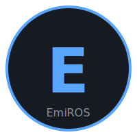

# EmiROS

<div align="center">



**Ultra-Hafif Linux Dağıtımı - Raspberry Pi 5**

[](LICENSE)
[]()
[]()

[Özellikler](#-özellikler) •
[Kurulum](#-hızlı-başlangıç) •
[Dokümantasyon](#-dokümantasyon) •
[Katkıda Bulunma](#-katkıda-bulunma)

</div>

---

## 📖 Proje Hakkında

**EmiROS**, Raspberry Pi 5 için özel olarak tasarlanmış ultra-hafif bir Linux dağıtımıdır. Buildroot tabanlı minimal bir sistem üzerine **X11 + XFCE4 masaüstü ortamı** ve **gerçek zamanlı web dashboard** ile birlikte gelir.

### Neden EmiROS?

- ⚡ **Ultra-Hafif**: Minimal footprint, maksimum performans
- 🖥️ **Tam Masaüstü**: Sadece CLI değil, gerçek XFCE4 masaüstü
- 🌐 **Web Dashboard**: Port 80'de erişilebilir modern web arayüzü
- 🚀 **Hızlı**: BusyBox init ile saniyeler içinde boot
- 🔧 **Özelleştirilebilir**: Buildroot ile istediğiniz gibi uyarlayın
- 📦 **Hazır**: Tek komutla build, QEMU ile test, SD karta flash

## ✨ Özellikler

### 🖥️ Masaüstü Ortamı

- **X11 (Xorg)** grafik sunucusu
- **XFCE4** tam masaüstü ortamı
  - xfce4-panel
  - xfce4-terminal
  - Thunar dosya yöneticisi
  - xfce4-settings
  - xfce4-taskmanager
  - xfwm4 pencere yöneticisi
- Otomatik giriş (auto-login)
- Özel EmiROS teması ve duvar kağıdı

### 🌐 Web Dashboard

Port 80'de çalışan modern, responsive web arayüzü:

- 🖥️ **CPU Kullanımı** (gerçek zamanlı)
- 🧠 **RAM Kullanımı** (kullanılan/toplam)
- 💾 **Disk Kullanımı**
- ⏱️ **Uptime**
- 🌐 **IP Adresi ve Hostname**
- 🔧 **Kernel Versiyonu**
- 🖥️ **XFCE Durumu**
- **Dark Theme** (GitHub tarzı)
- **Otomatik yenileme** (5 saniye)
- **Mobil uyumlu** responsive tasarım

### ⚙️ Sistem Özellikleri

- **Buildroot** tabanlı build sistemi
- **BusyBox init** (hafif ve hızlı)
- **BusyBox httpd** web sunucusu
- Raspberry Pi 5 optimizasyonları
- QEMU test desteği (aarch64)
- Tek komutla SD karta yazma
- VNC uzaktan erişim desteği

## 📸 Ekran Görüntüleri

### Web Dashboard

```
┌─────────────────────────────────────────────┐
│  🔵 EmiROS Dashboard                        │
│  Raspberry Pi 5 Ultra-Lightweight Linux     │
├─────────────────────────────────────────────┤
│  🖥️ CPU: 15.2%    🧠 RAM: 384/1024 MB      │
│  💾 Disk: 13%     ⏱️ Uptime: 2h 15m        │
│  🌐 IP: 192.168.1.100                       │
│  🔧 Kernel: 6.1.0-rpi5                      │
└─────────────────────────────────────────────┘
```

### XFCE4 Masaüstü

_(XFCE4 masaüstü ekran görüntüsü buraya gelecek)_

## 🚀 Hızlı Başlangıç

### Gereksinimler

Build için gerekli paketler (Ubuntu/Debian):

```bash
sudo apt-get update
sudo apt-get install -y \
    build-essential git wget cpio unzip rsync bc \
    libssl-dev libncurses5-dev device-tree-compiler \
    qemu-system-aarch64
```

### 1. Klonlama

```bash
git clone https://github.com/emiralpK/emiros.git
cd emiros
```

### 2. Build

```bash
# Buildroot'u indir
make download

# Konfigürasyonu uygula
make configure

# Build et (30-120 dakika sürer)
make build
```

### 3. QEMU ile Test

```bash
make qemu
```

Web dashboard: http://localhost:8080

### 4. SD Karta Flash

```bash
# SD kartınızı takın (örnek: /dev/sdc)
make flash DEVICE=/dev/sdc
```

### 5. Raspberry Pi'ye Yükleyin

1. SD kartı Raspberry Pi 5'e takın
2. HDMI, klavye, mouse bağlayın
3. Ethernet kablosu bağlayın (opsiyonel)
4. Gücü açın

EmiROS otomatik olarak boot edecek ve XFCE masaüstüne giriş yapacaktır!

## 🗂️ Proje Yapısı

```
emiros/
├── README.md                   # Bu dosya
├── LICENSE                     # MIT License
├── Makefile                    # Ana build dosyası
├── configs/                    # Buildroot ve kernel konfigürasyonları
│   ├── emiros_rpi5_defconfig  # Buildroot defconfig
│   └── kernel.config          # Kernel config
├── scripts/                    # Build ve yardımcı scriptler
│   ├── build.sh               # Build scripti
│   ├── run-qemu.sh            # QEMU test scripti
│   ├── flash-sd.sh            # SD kart flash scripti
│   └── setup-host.sh          # Hosting kurulum scripti
├── rootfs_overlay/            # Root filesystem overlay
│   ├── etc/                   # Sistem konfigürasyonları
│   ├── root/                  # Root kullanıcı dosyaları
│   ├── usr/share/emiros/      # EmiROS varlıkları (logo, duvar kağıdı)
│   └── var/www/               # Web dashboard
├── boot/                      # Raspberry Pi boot dosyaları
│   ├── config.txt             # Boot konfigürasyonu
│   └── cmdline.txt            # Kernel komut satırı
├── docs/                      # Detaylı dokümantasyon
│   ├── building.md            # Build talimatları
│   ├── installation.md        # Kurulum rehberi
│   ├── hosting.md             # Web hosting rehberi
│   └── xfce-customization.md  # XFCE özelleştirme
└── web/                       # Web kaynak dosyaları
    ├── index.html
    ├── css/style.css
    └── js/app.js
```

## 📚 Dokümantasyon

Detaylı dokümantasyon için `docs/` dizinine bakın:

- **[Building Guide](docs/building.md)** - Detaylı build talimatları
- **[Installation Guide](docs/installation.md)** - Kurulum ve ilk yapılandırma
- **[Hosting Guide](docs/hosting.md)** - emiralpkayikci.com'da host etme
- **[XFCE Customization](docs/xfce-customization.md)** - Masaüstü özelleştirme

## 🌐 emiralpkayikci.com'da Host Etme

EmiROS, Raspberry Pi 5 üzerinde PiOS içinde QEMU ile çalıştırılarak emiralpkayikci.com'da host edilebilir.

Kısa adımlar:

```bash
# PiOS üzerinde QEMU kurulumu ve yapılandırma
sudo ./scripts/setup-host.sh

# Servisi başlat
sudo systemctl start emiros-qemu

# DNS'i yapılandır: emiralpkayikci.com → Pi'nin public IP'si
# Router'da port forwarding: 80 → Pi'nin local IP'si
```

Detaylar için: [Hosting Guide](docs/hosting.md)

## 🔧 Özelleştirme

### Paket Ekleme/Çıkarma

```bash
cd buildroot-2024.02
make O=../output menuconfig
# Değişikliklerinizi yapın
make O=../output savedefconfig
cp ../output/defconfig ../configs/emiros_rpi5_defconfig
```

### Web Dashboard Özelleştirme

`rootfs_overlay/var/www/` veya `web/` dizinindeki dosyaları düzenleyin:

- `index.html` - Sayfa yapısı
- `css/style.css` - Stil ve tema
- `js/app.js` - İstemci tarafı mantığı
- `cgi-bin/sysinfo.sh` - API backend

### Kernel Özelleştirme

```bash
cd buildroot-2024.02
make O=../output linux-menuconfig
# Kernel konfigürasyonunu değiştirin
```

## 🎯 Kullanım Senaryoları

- 🏠 **Ev Sunucusu**: Hafif web sunucusu ve monitoring
- 📊 **Dashboard**: Sistem metrikleri görüntüleme
- 🧪 **Geliştirme**: Embedded Linux geliştirme platformu
- 📚 **Eğitim**: Linux sistem yönetimi öğrenme
- 🎨 **Özelleştirme**: Kendi distronuzu oluşturma temeli

## 🐛 Sorun Giderme

### Build Hataları

```bash
# Temizle ve tekrar dene
make clean
make build
```

### QEMU Çalışmıyor

```bash
# QEMU kurulu mu kontrol et
qemu-system-aarch64 --version

# Kurulum
sudo apt-get install qemu-system-aarch64
```

### SD Kart Flash Sorunu

```bash
# Doğru cihazı kullandığınızdan emin olun
lsblk

# Root olarak çalıştırın
sudo ./scripts/flash-sd.sh /dev/sdX
```

Daha fazla sorun giderme: [Installation Guide](docs/installation.md)

## 🤝 Katkıda Bulunma

Katkılarınızı bekliyoruz! 

1. Fork yapın
2. Feature branch oluşturun (`git checkout -b feature/amazing-feature`)
3. Commit yapın (`git commit -m 'feat: Add amazing feature'`)
4. Push edin (`git push origin feature/amazing-feature`)
5. Pull Request açın

### Geliştirme Alanları

- 🎨 XFCE tema geliştirmeleri
- 📊 Web dashboard yeni metrikler
- 🔧 Buildroot paket optimizasyonları
- 📖 Dokümantasyon iyileştirmeleri
- 🌍 Çok dilli destek
- 🔒 Güvenlik geliştirmeleri

## 📋 Yapılacaklar

- [ ] Bluetooth desteği
- [ ] WiFi yapılandırma arayüzü
- [ ] Docker desteği (opsiyonel)
- [ ] Daha fazla XFCE teması
- [ ] Otomatik güncelleme mekanizması
- [ ] Mobil web dashboard uygulaması
- [ ] Benchmark araçları

## 📄 Lisans

Bu proje [MIT License](LICENSE) ile lisanslanmıştır.

```
MIT License

Copyright (c) 2026 emiralpK

Permission is hereby granted, free of charge, to any person obtaining a copy
of this software and associated documentation files (the "Software")...
```

## 🙏 Teşekkürler

- [Buildroot](https://buildroot.org/) - Embedded Linux build sistemi
- [XFCE](https://xfce.org/) - Hafif masaüstü ortamı
- [Raspberry Pi Foundation](https://www.raspberrypi.org/) - Raspberry Pi 5
- Tüm açık kaynak topluluğu

## 📬 İletişim

- 🌐 Website: [emiralpkayikci.com](https://emiralpkayikci.com)
- 💻 GitHub: [@emiralpK](https://github.com/emiralpK)
- 📧 Email: info@emiralpkayikci.com

## ⭐ Yıldız Tarihçesi

[](https://starchart.cc/emiralpK/emiros)

---

<div align="center">

**Made with ❤️ by [emiralpK](https://github.com/emiralpK)**

⭐ Bu projeyi beğendiyseniz yıldız vermeyi unutmayın!

</div>